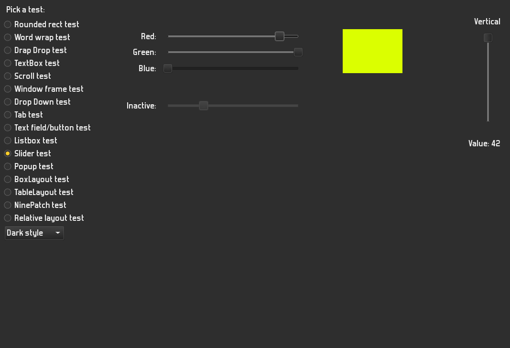

lgui
===================

lgui is a C++ 11/14 GUI currently coming with an Allegro 5 backend.

Features
========

- easy to use signals & slots to connect widgets (just register something callable - a std::function)
- two pass layout system, Android style; separate widgets and layouts, nestable layouts
- drawing done in separate style classes
- internal drag and drop
- modal widgets, GUI stacks
- event filters
- 9-patch images

Screenshots
========

Dark theme:



Bright theme:


Code samples
============
React to button click:
```
button.on_activated.connect([this]() {
    do_something();    
});
```
Mirror text from a text input field in a text label somewhere else: 
```
input.on_text_changed.connect([this](const std::string& text) {
    text_label.set_text(text);
});
```
Construct a relative layout:
```
using Constraint = lgui::RelativeLayout::Constraint;
lgui::RelativeLayout layout;
layout.add_item(bt1, { {Constraint::AlignParentTop} });
layout.add_item(bt2, { {Constraint::AlignLeft,  bt1}, {Constraint::Below, bt1} });
layout.add_item(bt3, { {Constraint::RightOf,    bt2}, {Constraint::Below, bt2} });
layout.add_item(bt4, { {Constraint::AlignRight, bt3}, {Constraint::Below, bt3},
                       {Constraint::AlignParentBottom } });
layout.add_item_ltrb(big_button, 0.7, 0.3, 0.9, 0.4);
container.set_layout(&layout);
```

Dependencies
============

You need to have Allegro5 and CMake installed; for the documentation, doxygen
is needed as well.

The documentation has to be generated explicitly by issuing the `make doc`
command from within your build directory. 

Feel free to report any issues you might have. Or fix them right away ;) 
-- pull requests are welcome.
